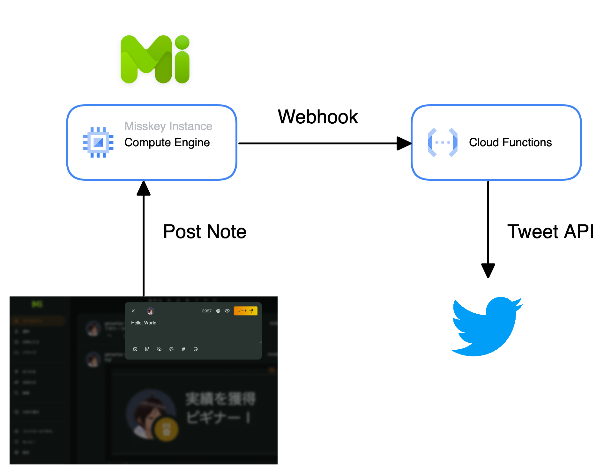
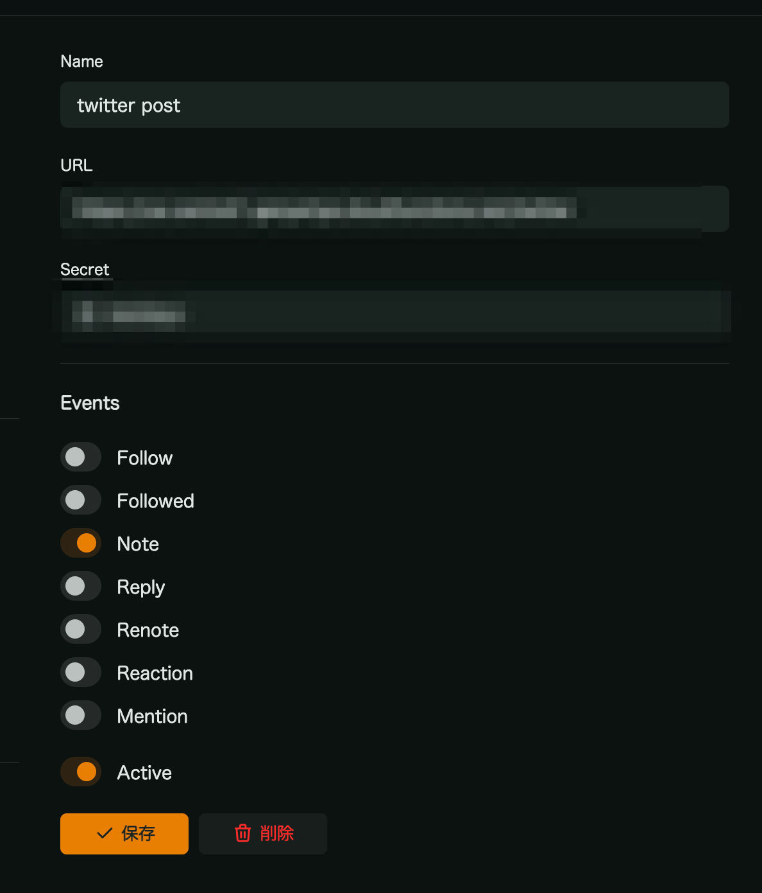
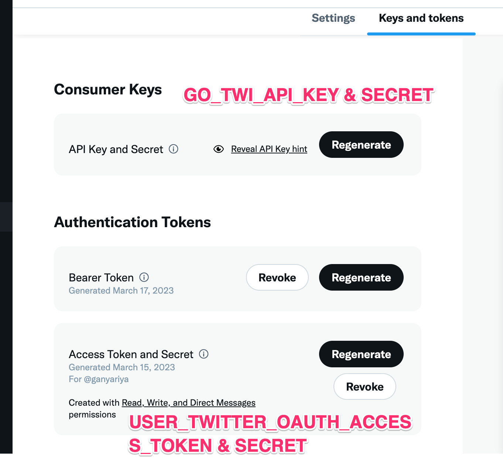

# Misskey Twitter Post

Cloud function posting Misskey your notes to Twitter.



## Setup for use

#### Misskey Webhook Setting

https://misskey-hub.net/docs/features/webhook.html

https://your-misskey-domain/settings/webhook

1. Open your misskey-domain webhook setting page.
2. Setup webhook setting about note event.
  - `URL` is your cloud function http endpoint.
  - `Secret` equals to `MISSKEY_HOOK_SECRET` in `.env.yaml`



#### Clone

```bash
gh repo clone ganyariya/misskey-twitter-post
cd misskey-twitter-post

# install go libraries
go mod tidy
```

#### Set Environment Variables

```bash
cp .env_sample.yaml .env.yaml
```

Fill in the `.env.yaml` file.

```yaml
# https://developer.twitter.com/en/portal/dashboard
# Consumer Keys
GOTWI_API_KEY: sample
GOTWI_API_KEY_SECRET: sample
# Authenticated Tokens (Your Twitter Account)
USER_TWITTER_OAUTH_ACCESS_TOKEN: sample
USER_TWITTER_OAUTH_ACCESS_TOKEN_SECRET: sample

# https://misskey-hub.net/docs/features/webhook.html
# https://misskey.ganyariya.net/settings/webhook
MISSKEY_HOOK_SECRET: sample

# Post tweet with misskey account url
MISSKEY_ACCOUNT: your-misskey.domain/@your-account
```



#### Deploy cloud function

```bash
# deploy
gcloud functions deploy twitter --entry-point twitter  --trigger-http --runtime go120 --env-vars-file .env.yaml --allow-unauthenticated
```

You can confirm the detail of the function in gcp console.
https://console.cloud.google.com/functions/list

`https://{zone}-{project-id}.cloudfunctions.net/twitter` endpoint will be created.    
Then, you fill this endpoint into Misskey Webhook URL.   
Finally, when you post note on Misskey, misskey and cloud function automatically posts your note to twitter.

#### Local Test

```bash
# Set Environment Variables
export GOTWI_API_KEY=...
...
export MISSKEY_ACCOUNT=...

FUNCTION_TARGET=twitter go run ./cmd/main.go  

curl  curl http://localhost:8080 -X POST -d 'your-misskey-request-json' -H 'X-Misskey-Hook-Secret:your-secret'
```

You can copy the content `your-misskey-request-json` from gcp console (cloud functions log).

## 🎉 Welcome for your PR!

for example...

- [ ] Post To Twitter with image.
- [ ] Split misskey note's text into several tweets of 140 characters, because of twitter restriction
- [ ] Support Reply Event

## Link

- Misskey
  - https://misskey-hub.net/docs/features/webhook.html
- Cloud Function
  - https://blog.jp.square-enix.com/iteng-blog/posts/00027-cloud-functions-go/
  - https://cloud.google.com/functions/docs/concepts/go-runtime?hl=ja
  - https://cloud.google.com/functions/docs/configuring/env-var?hl=ja#gcloud
  - https://cloud.google.com/functions/docs/deploy?hl=ja
- Twitter
  - https://github.com/g8rswimmer/go-twitter/tree/master/v2#tweets
  - https://developer.twitter.com/en/portal/dashboard 

## License

MIT
